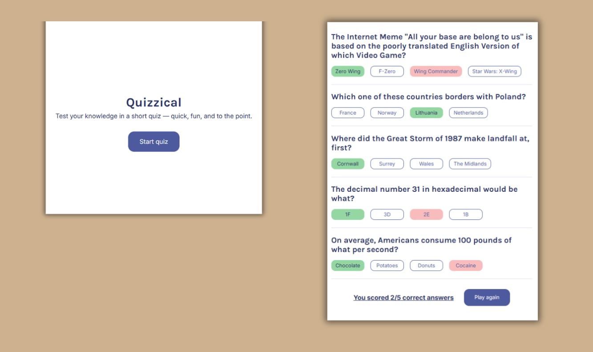

# Quizzical 🧠

[](https://ivandidenko-quizzical.netlify.app/)

> Click the image to view the demo. The link will open in the current tab (press `Ctrl + Click` or `Cmd + Click` to open in a new tab).

## Description

**Quizzical** is a trivia quiz app built with React. Pick a category and difficulty, answer 5 multiple-choice questions fetched live from the Open Trivia Database, and see how many you got right. Get them all and confetti rains down. 🎉

This project was created to practice React fundamentals, working with external APIs, conditional rendering, and responsive UI design.

## Features

- **Live Questions from Open Trivia DB**:
  - 5 multiple-choice questions per round
  - Answers shuffled randomly each time
  - HTML entities decoded for clean display

- **Answer Feedback**:
  - Correct answers highlighted in green
  - Wrong picks highlighted in pink
  - Score shown after checking answers

- **Game Flow**:
  - Check Answers button locked until all questions are answered
  - New Game loads fresh questions without leaving the quiz screen
  - Chicken Out button takes you back to the start screen anytime

- **Confetti** 🎉 — fires when you get a perfect score

- **Responsive Design**:
  - Full layout with side characters on desktop
  - Clean single-column layout on mobile

## Technologies Used

- **React 19** – Component-based UI
- **Vite** – Build tool and dev server
- **Open Trivia Database API** – Free trivia questions (`opentdb.com`)
- **he** – HTML entity decoder
- **clsx** – Conditional className helper
- **react-confetti** – Confetti animation on win
- **react-use** – `useWindowSize` hook for confetti sizing
- **CSS3** – Custom styling with grid, flexbox, and media queries
- **Google Fonts** – Montserrat typography

## What I Practiced

- Building and composing functional React components
- Managing state with `useState` and `useEffect`
- Fetching data from a public REST API with error handling
- Conditional rendering based on game state
- Using `clsx` to apply dynamic class names cleanly

## Getting Started

### Prerequisites

- Node.js (v18 or higher)
- npm

### Installation

1. Clone the repository:

```bash
git clone https://github.com/yourusername/quizzical.git
cd quizzical
```

2. Install dependencies:

```bash
npm install
```

3. Start the development server:

```bash
npm run dev
```

4. Open your browser and navigate to `http://localhost:5173`
